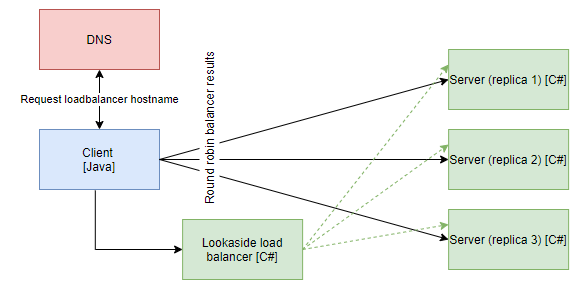

# Lookaside load balancing for gRPC Java client

## Overview



__NOTE: Run commands in root directory__

__NOTE: K8s files works with local docker images, change imagePullPolicy to allow remote registry__

__NOTE: enable verbose logging in Dockerfile by uncommenting line__

## Build images

```
docker build -t java-grpc-client-lookaside .\Java.Lookaside.ConsoleClientApp
docker build -t grpc-server-balancer:latest -f .\NetCoreGrpc.MyGrpcLoadBalancer\Dockerfile .
docker build -t grpc-server:latest -f .\NetCoreGrpc.ServerApp\Dockerfile .
```

## Create resources in K8s
```
kubectl apply -f .\k8s\grpc-server.yaml
kubectl apply -f .\k8s\grpc-server-balancer.yaml
kubectl create -f .\k8s\java-grpc-client-lookaside.yaml
```

## Verify connection

__NOTE: it may take up to 5 seconds for logs to start appear__

```
kubectl logs java-grpc-client-lookaside
```

## Tear down resources
```
kubectl delete -f .\k8s\java-grpc-client-lookaside.yaml
kubectl delete -f .\k8s\grpc-server-balancer.yaml
kubectl delete -f .\k8s\grpc-server.yaml
```

## Verify DNS SRV records
```
kubectl apply -f .\utils\dnsutils.yaml
kubectl exec -ti dnsutils -- nslookup -type=SRV _grpclb._tcp.grpc-server-balancer.default.svc.cluster.local
kubectl delete -f .\utils\dnsutils.yaml
```

## Sources

- https://github.com/grpc/grpc-java/issues/6848
- https://github.com/grpc/grpc-java/releases
- https://groups.google.com/forum/#!topic/grpc-io/YQiiNhuLtwE (version 1.14)
