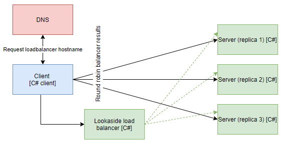

# Lookaside load balancing for gRPC C# client

## Overview



__NOTE: Run commands in root directory__

__NOTE: K8s files works with local docker images, change imagePullPolicy to allow remote registry__

## Build images
```
docker build -t grpc-csharp-client-lookaside:latest -f .\NetCoreGrpc.LoadBalanceExternal.ConsoleClientApp\Dockerfile .
docker build -t grpc-server-balancer:latest -f .\NetCoreGrpc.MyGrpcLoadBalancer\Dockerfile .
docker build -t grpc-server:latest -f .\NetCoreGrpc.ServerApp\Dockerfile .
```

## Create resources in K8s
```
kubectl apply -f .\k8s\grpc-server.yaml
kubectl apply -f .\k8s\grpc-server-balancer.yaml
kubectl create -f .\k8s\grpc-csharp-client-lookaside.yaml
```

## Verify connection
```
kubectl logs grpc-csharp-client-lookaside
```

## Tear down resources
```
kubectl delete -f .\k8s\grpc-csharp-client-lookaside.yaml
kubectl delete -f .\k8s\grpc-server-balancer.yaml
kubectl delete -f .\k8s\grpc-server.yaml
```

## Verify DNS SRV records
```
kubectl apply -f .\utils\dnsutils.yaml
kubectl exec -ti dnsutils -- nslookup -type=SRV _grpclb._tcp.grpc-server-balancer.default.svc.cluster.local
kubectl delete -f .\utils\dnsutils.yaml
```

## Useful links: 

- https://github.com/grpc/grpc/blob/master/doc/load-balancing.md
- https://grpc.io/blog/grpc-load-balancing/
- https://github.com/jtattermusch/grpc-loadbalancing-kubernetes-examples/blob/master/grpc_loadbalancing_kubernetes_slides.pdf
- https://github.com/jtattermusch/grpc-loadbalancing-kubernetes-examples
- https://tools.ietf.org/html/rfc2782 - describe SRV records in DNS
- https://github.com/grpc/grpc/blob/master/doc/environment_variables.md
- https://kubernetes.io/blog/2018/11/07/grpc-load-balancing-on-kubernetes-without-tears/
- https://github.com/grpc/grpc/issues/19401
- https://github.com/grpc/grpc/pull/17723
- https://github.com/grpc/grpc/blob/master/doc/naming.md
- https://github.com/grpc/proposal/blob/master/A5-grpclb-in-dns.md
- https://kubernetes.io/docs/concepts/services-networking/dns-pod-service/
- https://kubernetes.io/docs/tasks/administer-cluster/dns-debugging-resolution/
- https://serverfault.com/questions/99483/nslookup-for-srv-records-or-any-non-a-records-in-non-interactive-mode
- https://github.com/grpc/grpc/blob/master/src/core/ext/filters/client_channel/resolver/dns/c_ares/dns_resolver_ares.cc
- GRPC_ARG_DNS_ENABLE_SRV_QUERIES
- https://github.com/grpc/grpc/blob/master/src/csharp/Grpc.Core/ChannelOptions.cs
- https://github.com/grpc/grpc/blob/master/include/grpc/impl/codegen/grpc_types.h // list of all channel args
- GRPC_ARG_DNS_ENABLE_SRV_QUERIES => grpc.dns_enable_srv_queries
- set variable to 1 integer
- https://github.com/grpc/grpc-dotnet/issues/521
