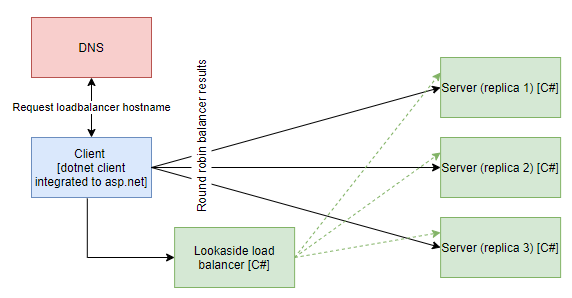

# Lookaside load balancing for gRPC dotnet client integrated with ASP.NET Core

## Overview



__NOTE: Run commands in root directory__

__NOTE: K8s files works with local docker images, change imagePullPolicy to allow remote registry__

## Build images
```
docker build -t grpc-dotnet-client-lookaside-aspnet:latest -f .\NetCoreGrpc.DotNet.LoadBalanceExternal.AspNetClientApp\Dockerfile .
docker build -t grpc-server-balancer:latest -f .\SimpleBalancer\Dockerfile .
docker build -t grpc-server:latest -f .\NetCoreGrpc.ServerApp\Dockerfile .
```

## Create resources in K8s
```
kubectl apply -f .\k8s\grpc-server.yaml
kubectl apply -f .\k8s\grpc-server-balancer.yaml
kubectl create -f .\k8s\grpc-dotnet-client-lookaside-aspnet.yaml
```

## Verify connection
```
kubectl port-forward grpc-dotnet-client-lookaside-aspnet 5500:5000
```

Open browser at your machine and type `http://localhost:5500/api/greeter/sayhello`. This should trigger asp.net core api controller to make loadbalanced requests and return values. 

## Tear down resources
```
kubectl delete -f .\k8s\grpc-dotnet-client-lookaside-aspnet.yaml
kubectl delete -f .\k8s\grpc-server-balancer.yaml
kubectl delete -f .\k8s\grpc-server.yaml
```

## Verify DNS SRV records
```
kubectl apply -f .\utils\dnsutils.yaml
kubectl exec -ti dnsutils -- nslookup -type=SRV _grpclb._tcp.grpc-server-balancer.default.svc.cluster.local
kubectl delete -f .\utils\dnsutils.yaml
```

[go back](../../README.md)