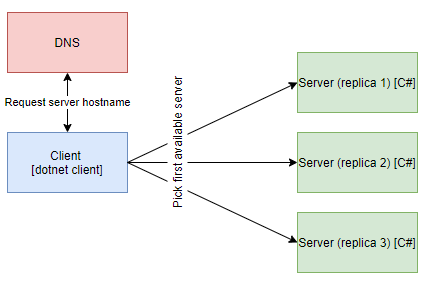

# Pick first load balancing for gRPC dotnet client

## Overview



__NOTE: Run commands in root directory__

__NOTE: K8s files works with local docker images, change imagePullPolicy to allow remote registry__

## Build images
```
docker build -t grpc-dotnet-client:latest -f .\NetCoreGrpc.DotNet.LoadBalanceClient.ConsoleClientApp\Dockerfile .
docker build -t grpc-server:latest -f .\NetCoreGrpc.ServerApp\Dockerfile .
```

## Create resources in K8s
```
kubectl apply -f .\k8s\grpc-server.yaml
kubectl create -f .\k8s\grpc-dotnet-client-pick-first.yaml
```

## Verify connection
```
kubectl logs grpc-dotnet-client-pick-first
```

## Tear down resources
```
kubectl delete -f .\k8s\grpc-dotnet-client-pick-first.yaml
kubectl delete -f .\k8s\grpc-server.yaml
```

## Verify DNS SRV records
```
kubectl apply -f .\utils\dnsutils.yaml
kubectl exec -ti dnsutils -- nslookup -type=A grpc-server.default.svc.cluster.local
kubectl delete -f .\utils\dnsutils.yaml
```

[go back](../../README.md)