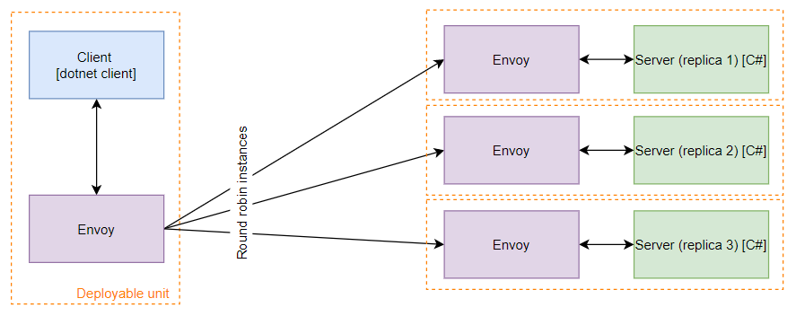

# Loadbalancing using sidecar proxy with dynamic configuration for gRPC dotnet client

## Overview



__NOTE: Run commands in root directory__

__NOTE: K8s files works with local docker images, change imagePullPolicy to allow remote registry__

## Prerequisites

- Install `istioctl` on your machine
- Install istio to k8s cluster `istioctl manifest apply --set profile=default`

## Build images
```
docker build -t grpc-dotnet-client-sidecar:latest -f .\NetCoreGrpc.DotNet.SidecarClient.ConsoleClientApp\Dockerfile .
docker build -t grpc-server:latest -f .\NetCoreGrpc.ServerApp\Dockerfile .
```

## Create resources in K8s
```
kubectl label --overwrite namespace default istio-injection=disabled
kubectl apply -f .\k8s\grpc-server-non-headless.yaml
kubectl label --overwrite namespace default istio-injection=enabled
kubectl create -f .\k8s\grpc-dotnet-client-sidecar-dynamic.yaml
```

## Verify connection
```
kubectl logs grpc-dotnet-client-sidecar-dynamic grpc-dotnet-client-sidecar-dynamic
```

## Tear down resources
```
kubectl delete -f .\k8s\grpc-dotnet-client-sidecar-dynamic.yaml
kubectl delete -f .\k8s\grpc-server-non-headless.yaml
kubectl label --overwrite namespace default istio-injection=disabled
```

[go back](../../README.md)